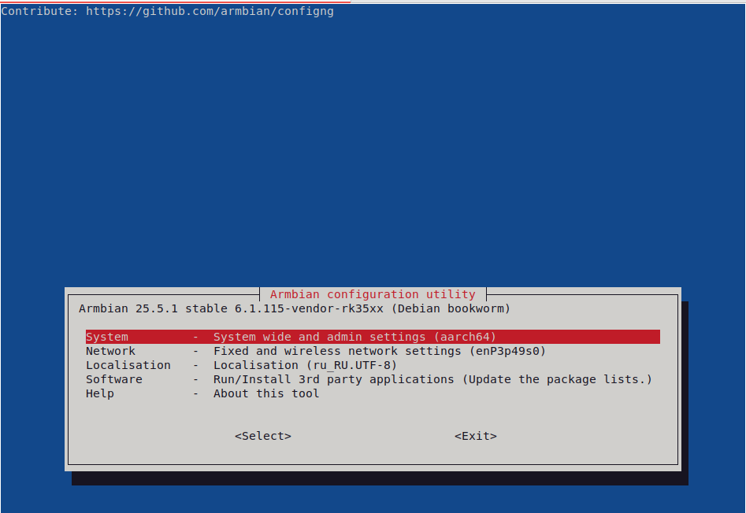
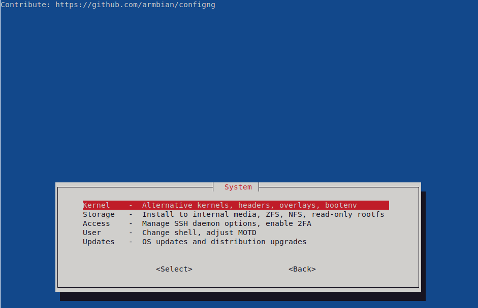
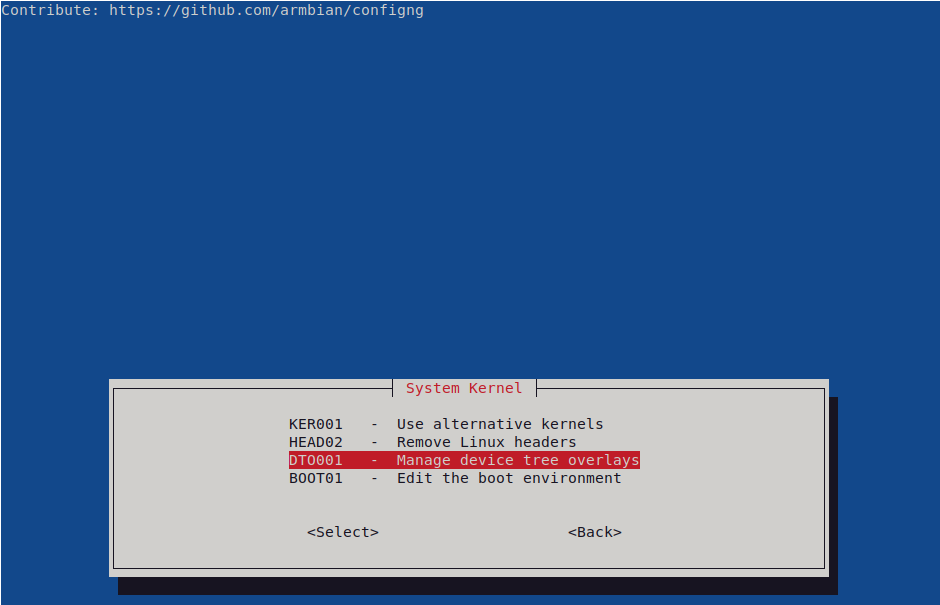
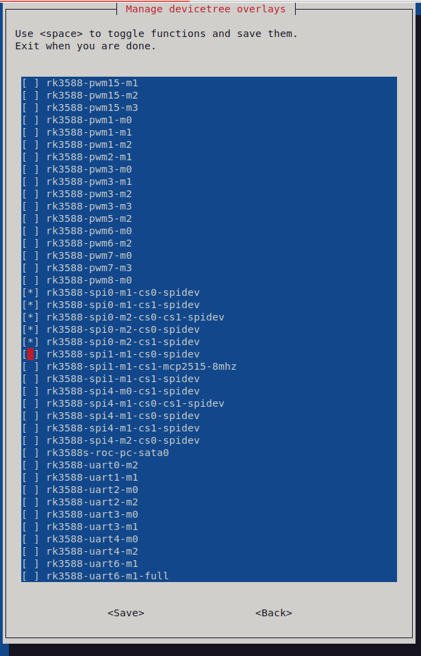

# Orange Pi ST7789 library

## 🙏 Благодарности / Acknowledgements

Спасибо [Pimoroni](https://github.com/pimoroni) за разработку оригинальной библиотеки [st7789-python](https://github.com/pimoroni/st7789-python), которая послужила основой для этой адаптации.

---

Thanks to [Pimoroni](https://github.com/pimoroni) for their work on the original [st7789-python](https://github.com/pimoroni/st7789-python) library, which formed the basis for this adaptation. 


## ✅ Требования / Requirements

### 📌 Общие шаги перед использованием / Steps before installing

---
### Russian

1. **Включить SPI-интерфейс в системе (Armbian или Orange Pi Debian)**  
   - **Для Orange Pi**: см. официальную документацию [здесь](https://drive.google.com/drive/folders/1Ov3mZqnMOf_8wpNt9rDxoGIR1ray2iiy), стр. 159.  
   - **Для Armbian:**
     1. Откройте консоль от имени администратора.
     2. Выполните команду: `armbian-config`
        
     3. Перейдите в раздел `System` → `Kernel` → `Manage device tree overlays`
        
        
     4. В открывшемся списке найдите и включите опцию `spi-spidev`. (обычно — SPI0)
        

2. **Установить библиотеку для GPIO на базе RockChip (например, rk3588)**  
   - Инструкции находятся по [ссылке](https://drive.google.com/drive/folders/1Ov3mZqnMOf_8wpNt9rDxoGIR1ray2iiy):  
     - стр. 224 — справочная информация  
     - стр. 226 — шаги установки

3. **Установить системные пакеты**
    ```bash
    apt update && apt install -y python3-pil python3-numpy python3-spidev
    ```

4. **Создать виртуальное окружение с системными пакетами (для доступа к `wiringOP`)**  
   ```bash
   python3 -m venv --system-site-packages devenv 
   ```

---
### English

1. **Enable SPI interface (Armbian or Orange Pi Debian)**  
   - **For Orange Pi**: see the [official documentation](https://drive.google.com/drive/folders/1Ov3mZqnMOf_8wpNt9rDxoGIR1ray2iiy), page 159.  
   - **For Armbian:**
     1. Open terminal as root.
     2. Run: `armbian-config`
        
     3. Navigate to `System` → `Kernel` → `Manage device tree overlays`
        
        
     4. Scroll down and enable the `spi-spidev` option (typically SPI0)
        

2. **Install GPIO control library for RockChip-based boards (e.g., rk3588)**  
   - Detailed instructions available [here](https://drive.google.com/drive/folders/1Ov3mZqnMOf_8wpNt9rDxoGIR1ray2iiy):  
     - page 224 — reference  
     - page 226 — installation

3. **Install system packages**
    ```bash
    apt update && apt install -y python3-pil python3-numpy python3-spidev
    ```
4. **Create Python 3 virtual environment with access to system packages (`wiringOP` support)**  
   ```bash
   python3 -m venv --system-site-packages devenv 
   ```

--- 

## 🚀 Установка / Installing

**Скопируйте репозиторий и файл библиотеки:**

```bash
git clone https://github.com/kamnetanker/orangepi_ST7789
cd orangepi_ST7789
cp st7789.py examples/ /path/to/your/devenv
```

---

## 🚀 Installing

**Clone the repository and copy the library file:**

```bash
git clone https://github.com/kamnetanker/orangepi_ST7789
cd orangepi_ST7789
cp st7789.py examples/ /path/to/your/devenv
```

---

## 💡 Использование / Usage

1. **Определите GPIO-порты дисплея: / Identify GPIO pins used for connecting the display:**

   ```bash
   gpio readall
   ```

2. **Пример вывода `gpio readall`: / Example `gpio readall` output:**

   ```text
     +------+-----+----------+--------+---+ PI5 PLUS +---+--------+----------+-----+------+
    | GPIO | wPi |   Name   |  Mode  | V | Physical | V |  Mode  | Name     | wPi | GPIO |
    +------+-----+----------+--------+---+----++----+---+--------+----------+-----+------+
    |      |     |     3.3V |        |   |  1 || 2  |   |        | 5V       |     |      |
    |   16 |   0 |    SDA.2 |     IN | 0 |  3 || 4  |   |        | 5V       |     |      |
    |   15 |   1 |    SCL.2 |     IN | 0 |  5 || 6  |   |        | GND      |     |      |
    |   62 |   2 |    PWM14 |     IN | 1 |  7 || 8  | 0 | IN     | GPIO1_A1 | 3   | 33   |
    |      |     |      GND |        |   |  9 || 10 | 0 | IN     | GPIO1_A0 | 4   | 32   |
    |   36 |   5 | GPIO1_A4 |     IN | 0 | 11 || 12 | 1 | IN     | GPIO3_A1 | 6   | 97   |
    |   39 |   7 | GPIO1_A7 |     IN | 1 | 13 || 14 |   |        | GND      |     |      |
    |   40 |   8 | GPIO1_B0 |     IN | 1 | 15 || 16 | 1 | IN     | GPIO3_B5 | 9   | 109  |
    |      |     |     3.3V |        |   | 17 || 18 | 0 | IN     | GPIO3_B6 | 10  | 110  |
    |   42 |  11 | SPI0_TXD |   ALT8 | 1 | 19 || 20 |   |        | GND      |     |      |
    |   41 |  12 | SPI0_RXD |   ALT8 | 1 | 21 || 22 | 0 | IN     | GPIO1_A2 | 13  | 34   |
    |   43 |  14 | SPI0_CLK |   ALT8 | 0 | 23 || 24 | 1 | IN     | SPI0_CS0 | 15  | 44   |
    |      |     |      GND |        |   | 25 || 26 | 1 | ALT8   | SPI0_CS1 | 16  | 45   |
    |   47 |  17 | GPIO1_B7 |    OUT | 1 | 27 || 28 | 1 | IN     | GPIO1_B6 | 18  | 46   |
    |   63 |  19 | GPIO1_D7 |    OUT | 1 | 29 || 30 |   |        | GND      |     |      |
    |   96 |  20 | GPIO3_A0 |    OUT | 1 | 31 || 32 | 0 | IN     | GPIO1_A3 | 21  | 35   |
    |  114 |  22 | GPIO3_C2 |     IN | 0 | 33 || 34 |   |        | GND      |     |      |
    |   98 |  23 | GPIO3_A2 |     IN | 1 | 35 || 36 | 0 | IN     | GPIO3_A5 | 24  | 101  |
    |  113 |  25 | GPIO3_C1 |     IN | 0 | 37 || 38 | 0 | IN     | GPIO3_A4 | 26  | 100  |
    |      |     |      GND |        |   | 39 || 40 | 1 | OUT    | GPIO3_A3 | 27  | 99   |
    +------+-----+----------+--------+---+----++----+---+--------+----------+-----+------+
    | GPIO | wPi |   Name   |  Mode  | V | Physical | V |  Mode  | Name     | wPi | GPIO |
    +------+-----+----------+--------+---+ PI5 PLUS +---+--------+----------+-----+------+

   ```

3. **Подключение дисплея / Display wiring:**

   | Display Pin | Board Pin | Signal    | wPi |
   |------------:|----------:|-----------|----:|
   | GND         | 25        | GND       |  -  |
   | VCC         | 17        | 3.3V      |  -  |
   | SCL         | 23        | SPI0_CLK  | 14  |
   | SDA         | 19        | SPI0_TXD  | 11  |
   | RES         | 27        | GPIO1_B7  | 17  |
   | DC          | 29        | GPIO1_D7  | 19  |
   | CS          | 26        | SPI0_CS1  | 16  |
   | BLK         | 31        | GPIO3_A0  | 20  |

4. **Проверить активные SPI-устройства / Check active SPI devices:**

   ```bash
   ls /dev/ | grep spi
   ```

   **Пример вывода / Example output:**

   ```
   rkspi-dev0
   rkspi-dev2
   spidev0.0
   spidev0.1
   ```

5. **Настройка параметров в `examples/round.py` / Configure in example script:**

   ```python
   SPI_PORT  = 0   # SPI0
   SPI_CS    = 1   # CS1
   SPI_DC    = 19  # wPi 19 (GPIO1_D7)
   SPI_RES   = 17  # wPi 17 (GPIO1_B7)
   BACKLIGHT = 20  # wPi 20 (GPIO3_A0)
   ```
   > Так как я подключил дисплей к **SPI0**, то `SPI_PORT=0`.   
   > А так как я подключил CS к **SPI0_CS1**, то `SPI_CS = 1`.   
   > Далее переменные заполняются соответственно столбцу `wpi` из таблицы подключения выше.
   ---
    > Since the display is connected to **SPI0**, `SPI_PORT = 0`.  
    > And since the CS pin is wired to **SPI0_CS1**, `SPI_CS = 1`.  
    > Remaining values are taken from the `wPi` column in the wiring table above.

## 🛠 Автор и поддержка

**Kamnetanker**  
🇷🇺 kamnetanker3@gmail.com  
🔗 https://github.com/kamnetanker/orangepi_ST7789

> Если в инструкции обнаружите ошибку - напишите на почту, я исправлю или отправьте pull request.  
> If u will find mistake - write to email and I will fix it here. Or create pull request.  
> **Без гарантий**.  
> Этот проект обновляется и поддерживается по моему собственному желанию и в свободное время.  
> Используйте внося изменения под ваши задачи.

---